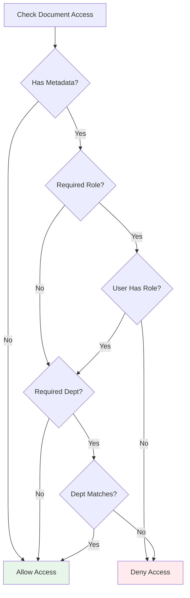

# Document Access Control

## Overview

The `DocumentAccessControl` component implements **role-based access control (RBAC)** and **attribute-based access control (ABAC)** for retrieved documents in a RAG system. It ensures users only receive information they're authorized to access based on their roles and department affiliation.

This prevents unauthorized data exposure through AI responses, even when documents are retrieved by similarity search.

## Why Access Control Matters in RAG

### The Problem

Traditional RAG systems retrieve documents based solely on semantic similarity. This creates a security vulnerability:

```
User Query: "What's the company's Q4 revenue?"
Vector Search: Finds "Q4 Financial Results - CONFIDENTIAL - Finance Dept Only"
AI Response: "Q4 revenue was $50M..." ❌ LEAKED CONFIDENTIAL DATA
```

**Without access control**, the RAG system inadvertently discloses information the user shouldn't see.

### The Solution

Filter retrieved documents based on user context **before** generating the response:

```
User Query: "What's the company's Q4 revenue?"
Vector Search: Finds "Q4 Financial Results - CONFIDENTIAL - Finance Dept Only"
Access Control: User is in Sales dept, not Finance → FILTER OUT
AI Response: "I don't have access to that information." ✓ SECURE
```

## Component Responsibilities

1. **Document Filtering**: Remove documents the user can't access
2. **Permission Checking**: Verify role and department requirements
3. **ACL Enrichment**: Add access control metadata to documents

## Implementation

### Location
```
/src/main/java/com/techcorp/assistant/module05/security/DocumentAccessControl.java
```

### Core Code

```java
@Service
public class DocumentAccessControl {

    private static final Logger log = LoggerFactory.getLogger(DocumentAccessControl.class);

    public List<RetrievedDocument> filterByPermissions(
            List<RetrievedDocument> documents,
            List<String> userRoles,
            String userDepartment) {

        if (documents == null || documents.isEmpty()) {
            return List.of();
        }

        List<RetrievedDocument> filtered = documents.stream()
                .filter(doc -> hasAccess(doc, userRoles, userDepartment))
                .collect(Collectors.toList());

        int filteredCount = documents.size() - filtered.size();
        if (filteredCount > 0) {
            log.info("Filtered {} documents based on access control", filteredCount);
        }

        return filtered;
    }

    public boolean hasAccess(RetrievedDocument document,
                            List<String> userRoles,
                            String userDepartment) {
        DocumentMetadata metadata = document.metadata();

        if (metadata == null) {
            return true;  // No restrictions - allow access
        }

        // Check required role
        String requiredRole = metadata.requiredRole();
        if (requiredRole != null && !requiredRole.isBlank()) {
            if (userRoles == null || !userRoles.contains(requiredRole)) {
                log.debug("Access denied to document {} - missing required role: {}",
                        document.id(), requiredRole);
                return false;
            }
        }

        // Check department
        String docDepartment = metadata.department();
        if (docDepartment != null && !docDepartment.isBlank()) {
            if (userDepartment == null || !docDepartment.equals(userDepartment)) {
                log.debug("Access denied to document {} - department mismatch: required={}, user={}",
                        document.id(), docDepartment, userDepartment);
                return false;
            }
        }

        return true;
    }

    public RetrievedDocument enrichWithACL(RetrievedDocument document,
                                          String requiredRole,
                                          String department) {
        DocumentMetadata enrichedMetadata = new DocumentMetadata(department, requiredRole);
        return new RetrievedDocument(
                document.id(),
                document.content(),
                document.score(),
                enrichedMetadata
        );
    }
}
```

## How It Works

### Permission Model

Documents have metadata specifying access requirements:

```java
public record DocumentMetadata(String department, String requiredRole) {}
```

**Department**: Restricts access to users in a specific department
- `"finance"`: Only Finance department users
- `"engineering"`: Only Engineering department users
- `null`: No department restriction

**Required Role**: Requires user to have a specific role
- `"admin"`: Only users with admin role
- `"manager"`: Only managers
- `null`: No role restriction

### Access Decision Logic



**Decision process**:
1. If document has no metadata → **Allow** (public document)
2. If metadata specifies required role:
   - User must have that role → Continue to dept check
   - User lacks role → **Deny**
3. If metadata specifies department:
   - User's department must match → **Allow**
   - Departments don't match → **Deny**
4. If all checks pass → **Allow**

### Filtering in Action

```java
List<RetrievedDocument> docs = List.of(
    new RetrievedDocument("doc1", "Public content", 0.95, null),
    new RetrievedDocument("doc2", "Finance data", 0.90,
        new DocumentMetadata("finance", null)),
    new RetrievedDocument("doc3", "Admin only", 0.85,
        new DocumentMetadata(null, "admin"))
);

List<String> userRoles = List.of("user");
String userDept = "engineering";

List<RetrievedDocument> accessible = documentAccessControl.filterByPermissions(
    docs, userRoles, userDept
);

// Result: Only doc1 accessible
// doc2 filtered (wrong department)
// doc3 filtered (missing admin role)
```

## Usage Examples

### In a RAG Controller

```java
@PostMapping("/query")
public ResponseEntity<RAGResponse> query(@RequestBody SecureRequest request) {
    // Extract user context from request or authentication
    List<String> userRoles = request.userRoles();
    String userDept = request.department();

    // Retrieve documents (no filtering yet)
    List<RetrievedDocument> allDocs = ragService.retrieve(request.query());

    // Filter by permissions
    List<RetrievedDocument> accessibleDocs = documentAccessControl.filterByPermissions(
        allDocs, userRoles, userDept
    );

    if (accessibleDocs.isEmpty()) {
        return ResponseEntity.ok(new RAGResponse(
            "I don't have access to information that can answer your question.",
            List.of()
        ));
    }

    // Generate response from accessible documents only
    String response = ragService.generate(request.query(), accessibleDocs);

    return ResponseEntity.ok(new RAGResponse(response, accessibleDocs));
}
```

### Integrating with Spring Security

```java
@Service
public class SecureRAGService {

    private final DocumentAccessControl accessControl;

    public RAGResponse secureQuery(String query) {
        // Get current user from Spring Security context
        Authentication auth = SecurityContextHolder.getContext().getAuthentication();
        UserDetails user = (UserDetails) auth.getPrincipal();

        // Extract roles
        List<String> roles = auth.getAuthorities().stream()
            .map(GrantedAuthority::getAuthority)
            .collect(Collectors.toList());

        // Get department from custom user details
        String department = ((CustomUserDetails) user).getDepartment();

        // Retrieve and filter documents
        List<RetrievedDocument> docs = vectorStore.search(query);
        List<RetrievedDocument> accessible = accessControl.filterByPermissions(
            docs, roles, department
        );

        return generateResponse(query, accessible);
    }
}
```

### Document Ingestion with ACLs

```java
@Service
public class DocumentIngestionService {

    private final DocumentAccessControl accessControl;
    private final VectorStore vectorStore;

    public void ingestDocument(String content, String dept, String requiredRole) {
        // Chunk the document
        List<String> chunks = chunker.chunk(content);

        for (int i = 0; i < chunks.size(); i++) {
            // Create document without ACL
            RetrievedDocument doc = new RetrievedDocument(
                UUID.randomUUID().toString(),
                chunks.get(i),
                0.0,
                null
            );

            // Enrich with ACL metadata
            RetrievedDocument enriched = accessControl.enrichWithACL(
                doc, requiredRole, dept
            );

            // Store in vector database with metadata
            vectorStore.add(enriched);
        }
    }
}
```

### Multi-tenant Isolation

```java
public List<RetrievedDocument> filterByTenant(
        List<RetrievedDocument> documents,
        String tenantId) {

    return documents.stream()
        .filter(doc -> {
            DocumentMetadata meta = doc.metadata();
            return meta != null &&
                   tenantId.equals(meta.department()); // Reuse dept field for tenant
        })
        .collect(Collectors.toList());
}
```

## Testing

### Unit Tests

Located at: `/src/test/java/com/techcorp/assistant/module05/security/DocumentAccessControlTest.java`

**Key test cases**:

```java
@Test
void testAllowAccessToPublicDocument() {
    RetrievedDocument doc = new RetrievedDocument("doc1", "content", 0.9, null);

    boolean hasAccess = accessControl.hasAccess(doc,
        List.of("user"), "engineering");

    assertTrue(hasAccess);
}

@Test
void testDenyAccessWhenDepartmentMismatch() {
    DocumentMetadata metadata = new DocumentMetadata("finance", null);
    RetrievedDocument doc = new RetrievedDocument("doc1", "content", 0.9, metadata);

    boolean hasAccess = accessControl.hasAccess(doc,
        List.of("user"), "engineering");

    assertFalse(hasAccess);
}

@Test
void testAllowAccessWhenRoleMatches() {
    DocumentMetadata metadata = new DocumentMetadata(null, "admin");
    RetrievedDocument doc = new RetrievedDocument("doc1", "content", 0.9, metadata);

    boolean hasAccess = accessControl.hasAccess(doc,
        List.of("user", "admin"), "engineering");

    assertTrue(hasAccess);
}

@Test
void testFilterRemovesInaccessibleDocuments() {
    List<RetrievedDocument> docs = List.of(
        new RetrievedDocument("doc1", "public", 0.95, null),
        new RetrievedDocument("doc2", "finance", 0.90,
            new DocumentMetadata("finance", null)),
        new RetrievedDocument("doc3", "engineering", 0.85,
            new DocumentMetadata("engineering", null))
    );

    List<RetrievedDocument> filtered = accessControl.filterByPermissions(
        docs, List.of("user"), "engineering"
    );

    assertEquals(2, filtered.size()); // doc1 and doc3
}
```

## Security Considerations

### Limitations

**Metadata trust**: This system assumes document metadata is accurate and hasn't been tampered with. Store metadata in a secure, immutable location.

**No hierarchical roles**: The current implementation doesn't support role hierarchies (e.g., "admin" implies "user"). Each role must be explicitly listed.

**No time-based access**: Access is static. There's no support for temporary access grants or time-limited permissions.

**No attribute-based rules**: Can't express complex policies like "managers in engineering with >2 years tenure".

### Best Practices

1. **Verify user context**: Always validate user roles and department from a trusted source (authentication token, session)
2. **Audit access denials**: Log when documents are filtered for security analysis
3. **Default deny**: If user context is missing, deny access to restricted documents
4. **Encrypt metadata**: Store ACL metadata encrypted in vector databases
5. **Separate indexes**: Consider maintaining separate vector indexes per department/role for performance

### Enhanced Access Control

**Hierarchical roles**:
```java
private static final Map<String, List<String>> ROLE_HIERARCHY = Map.of(
    "admin", List.of("admin", "manager", "user"),
    "manager", List.of("manager", "user"),
    "user", List.of("user")
);

public boolean hasRole(List<String> userRoles, String requiredRole) {
    return userRoles.stream()
        .flatMap(role -> ROLE_HIERARCHY.getOrDefault(role, List.of()).stream())
        .anyMatch(role -> role.equals(requiredRole));
}
```

**Time-based access**:
```java
public record DocumentMetadata(
    String department,
    String requiredRole,
    Instant validFrom,
    Instant validUntil
) {}

public boolean isTimeValid(DocumentMetadata metadata) {
    Instant now = Instant.now();
    return (metadata.validFrom() == null || now.isAfter(metadata.validFrom())) &&
           (metadata.validUntil() == null || now.isBefore(metadata.validUntil()));
}
```

**Complex policies**:
```java
@FunctionalInterface
public interface AccessPolicy {
    boolean allows(UserContext user, DocumentMetadata doc);
}

public boolean hasAccess(RetrievedDocument doc, UserContext user) {
    return accessPolicies.stream()
        .allMatch(policy -> policy.allows(user, doc.metadata()));
}
```

## Performance Optimization

### Filtering at Query Time vs Index Time

**Current approach (query-time filtering)**:
- Retrieve all matching documents
- Filter by permissions
- Return accessible subset

**Alternative (index-time filtering)**:
- Include user roles/dept in vector search query
- Database filters documents during retrieval
- No post-processing needed

**Index-time filtering example** (using Pinecone metadata filtering):
```java
public List<RetrievedDocument> searchWithFilter(String query,
                                                List<String> userRoles,
                                                String userDept) {
    Map<String, Object> filter = Map.of(
        "$or", List.of(
            Map.of("department", userDept),
            Map.of("department", Map.of("$exists", false))
        )
    );

    return vectorStore.search(query, filter);
}
```

### Caching Permissions

```java
@Cacheable(value = "accessCache",
           key = "#doc.id() + '_' + #userRoles + '_' + #userDept")
public boolean hasAccess(RetrievedDocument doc,
                        List<String> userRoles,
                        String userDept) {
    // Permission logic...
}
```

---

**Next Chapter**: [06 - Security Audit Service](./06-security-audit-service.md)

**Related Topics**:
- [Secure RAG Controller](./09-secure-rag-controller.md) - Complete integration
- [Simple RAG Service](./08-simple-rag-service.md) - Document retrieval
