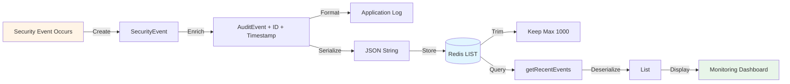

# Security Audit Service

## Overview

The `SecurityAuditService` provides comprehensive security event logging and monitoring for LLM applications. It records security-relevant events to Redis, enabling incident investigation, compliance reporting, threat detection, and operational monitoring.

This component is essential for production AI systems that must demonstrate accountability, detect attacks, and meet regulatory requirements.

## Why Security Auditing Matters

### Compliance Requirements

**SOC 2**: Requires logging of security events and access controls
**GDPR**: Mandates audit trails for data processing activities
**HIPAA**: Requires access logs for protected health information
**PCI DSS**: Demands detailed audit logs for payment card data

### Security Benefits

1. **Incident Response**: Investigate security breaches and attacks
2. **Threat Detection**: Identify patterns of malicious activity
3. **Forensics**: Reconstruct what happened during security incidents
4. **Accountability**: Track who did what and when
5. **Monitoring**: Real-time alerting on suspicious behavior

### Real-World Scenarios

**Detect prompt injection campaign**:
```
10:15:23 - User alice@example.com - PROMPT_INJECTION_BLOCKED
10:15:45 - User bob@example.com - PROMPT_INJECTION_BLOCKED
10:16:12 - User charlie@example.com - PROMPT_INJECTION_BLOCKED

Pattern: Multiple users, same attack pattern → Coordinated attack
```

**Investigate data leak**:
```
14:22:15 - User john@company.com - QUERY_SUCCESS
14:22:16 - User john@company.com - PII_DETECTED in output
14:22:17 - User john@company.com - Query: "Show me customer records"

Investigation: Response contained PII → Review source documents for leakage
```

## Component Responsibilities

1. **Event Logging**: Record security events with structured data
2. **Event Storage**: Persist events to Redis for durability
3. **Event Retrieval**: Query recent events for monitoring/analysis
4. **Severity Classification**: Tag events by criticality

## Implementation

### Location
```
/src/main/java/com/techcorp/assistant/module05/security/SecurityAuditService.java
```

### Core Code

```java
@Service
public class SecurityAuditService {

    private static final Logger log = LoggerFactory.getLogger(SecurityAuditService.class);

    private final RedisTemplate<String, String> redisTemplate;
    private final ObjectMapper objectMapper;

    @Value("${security.audit.redis-key:security-events}")
    private String redisKey;

    @Value("${security.audit.max-events:1000}")
    private int maxEvents;

    public SecurityAuditService(RedisTemplate<String, String> redisTemplate) {
        this.redisTemplate = redisTemplate;
        this.objectMapper = new ObjectMapper();
    }

    public void logSecurityEvent(SecurityEvent event) {
        AuditEvent auditEvent = new AuditEvent(
                UUID.randomUUID().toString(),
                event.type(),
                event.severity(),
                event.userId(),
                Instant.now(),
                event.details()
        );

        // Log to application logs
        String logMessage = String.format(
            "Security Event: type=%s, severity=%s, userId=%s, details=%s",
            auditEvent.type(), auditEvent.severity(),
            auditEvent.userId(), auditEvent.details()
        );

        switch (event.severity()) {
            case CRITICAL, HIGH -> log.error(logMessage);
            case MEDIUM -> log.warn(logMessage);
            case LOW -> log.info(logMessage);
        }

        // Store in Redis
        try {
            String eventJson = objectMapper.writeValueAsString(auditEvent);
            redisTemplate.opsForList().leftPush(redisKey, eventJson);

            // Trim to max events
            redisTemplate.opsForList().trim(redisKey, 0, maxEvents - 1);

        } catch (JsonProcessingException e) {
            log.error("Failed to serialize audit event to Redis", e);
        }
    }

    public List<AuditEvent> getRecentEvents(int count) {
        List<String> eventJsons = redisTemplate.opsForList().range(redisKey, 0, count - 1);

        if (eventJsons == null) {
            return List.of();
        }

        return eventJsons.stream()
                .map(json -> {
                    try {
                        return objectMapper.readValue(json, AuditEvent.class);
                    } catch (JsonProcessingException e) {
                        log.error("Failed to deserialize audit event", e);
                        return null;
                    }
                })
                .filter(event -> event != null)
                .collect(Collectors.toList());
    }

    public record SecurityEvent(
            String type,
            Severity severity,
            String userId,
            String details
    ) {}

    public record AuditEvent(
            String id,
            String type,
            Severity severity,
            String userId,
            Instant timestamp,
            String details
    ) {}

    public enum Severity {
        LOW,
        MEDIUM,
        HIGH,
        CRITICAL
    }
}
```

## How It Works

### Event Model

**SecurityEvent** (input):
- `type`: Event category (e.g., "PROMPT_INJECTION", "PII_DETECTED")
- `severity`: Importance level (LOW, MEDIUM, HIGH, CRITICAL)
- `userId`: Who triggered the event
- `details`: Additional context

**AuditEvent** (stored):
- Adds `id`: Unique identifier (UUID)
- Adds `timestamp`: When the event occurred (Instant)
- Includes all SecurityEvent fields

### Dual Logging Strategy

Events are logged to **two destinations**:

**1. Application Logs** (stdout/log files):
```java
switch (event.severity()) {
    case CRITICAL, HIGH -> log.error(logMessage);
    case MEDIUM -> log.warn(logMessage);
    case LOW -> log.info(logMessage);
}
```

**Benefits**:
- Immediate visibility in application logs
- Integration with existing log aggregation (Splunk, ELK, CloudWatch)
- Severity-based routing (CRITICAL → error logs → alerts)

**2. Redis** (structured storage):
```java
String eventJson = objectMapper.writeValueAsString(auditEvent);
redisTemplate.opsForList().leftPush(redisKey, eventJson);
```

**Benefits**:
- Structured queryable data
- Fast retrieval for dashboards
- Persistence (if Redis is configured for it)
- Time-series ordering

### Redis Data Structure

```
Key: "security-events" (configurable)
Type: LIST
Structure: [newest event, ..., oldest event]

Example:
LPUSH security-events '{"id":"abc123","type":"PROMPT_INJECTION",...}'
LRANGE security-events 0 99  # Get 100 most recent events
LTRIM security-events 0 999  # Keep only 1000 events
```

**Why a list?**
- **Ordered**: New events pushed to left, maintaining chronological order
- **Fast**: O(1) insertion, O(N) retrieval for N events
- **Bounded**: Trimming keeps memory usage constant

### Event Lifecycle



## Configuration

### Application Properties

```properties
# Redis key for storing events
security.audit.redis-key=security-events

# Maximum events to retain (older events are deleted)
security.audit.max-events=1000

# Redis connection (from spring-boot-starter-data-redis)
spring.data.redis.host=localhost
spring.data.redis.port=6379
spring.data.redis.password=
```

### Redis Configuration

The service requires a `RedisTemplate` bean (provided by Spring Boot):

```java
@Configuration
public class RedisConfig {

    @Bean
    public RedisTemplate<String, String> redisTemplate(
            RedisConnectionFactory connectionFactory) {
        RedisTemplate<String, String> template = new RedisTemplate<>();
        template.setConnectionFactory(connectionFactory);
        template.setKeySerializer(new StringRedisSerializer());
        template.setValueSerializer(new StringRedisSerializer());
        return template;
    }
}
```

## Usage Examples

### Logging Security Events

```java
@Service
public class SecureRAGController {

    private final SecurityAuditService auditService;

    @PostMapping("/query")
    public ResponseEntity<Response> query(@RequestBody Request request) {
        String userId = request.userId();

        // Log successful query
        auditService.logSecurityEvent(new SecurityEvent(
            "QUERY_PROCESSING",
            Severity.LOW,
            userId,
            "Query processed through security layers"
        ));

        // ... process query ...

        // Log prompt injection attempt
        if (injectionDetected) {
            auditService.logSecurityEvent(new SecurityEvent(
                "PROMPT_INJECTION",
                Severity.HIGH,
                userId,
                "Attempted: " + sanitize(request.query())
            ));
            return ResponseEntity.badRequest().build();
        }

        return ResponseEntity.ok(response);
    }
}
```

### Event Type Taxonomy

Organize events by category:

```java
public class SecurityEventTypes {
    // Authentication & Authorization
    public static final String LOGIN_SUCCESS = "LOGIN_SUCCESS";
    public static final String LOGIN_FAILED = "LOGIN_FAILED";
    public static final String ACCESS_DENIED = "ACCESS_DENIED";

    // Input Security
    public static final String PROMPT_INJECTION = "PROMPT_INJECTION";
    public static final String INPUT_VALIDATION_FAILED = "INPUT_VALIDATION_FAILED";
    public static final String PII_DETECTED_INPUT = "PII_DETECTED_INPUT";

    // Output Security
    public static final String UNSAFE_OUTPUT = "UNSAFE_OUTPUT";
    public static final String HALLUCINATION_DETECTED = "HALLUCINATION_DETECTED";
    public static final String PII_DETECTED_OUTPUT = "PII_DETECTED_OUTPUT";

    // Query Processing
    public static final String QUERY_SUCCESS = "QUERY_SUCCESS";
    public static final String QUERY_FAILED = "QUERY_FAILED";
    public static final String RATE_LIMIT_EXCEEDED = "RATE_LIMIT_EXCEEDED";
}
```

### Severity Guidelines

```java
public static Severity determineSeverity(String eventType) {
    return switch (eventType) {
        case "PROMPT_INJECTION", "DATA_LEAK" -> Severity.CRITICAL;
        case "UNSAFE_OUTPUT", "ACCESS_DENIED" -> Severity.HIGH;
        case "PII_DETECTED", "HALLUCINATION_DETECTED" -> Severity.MEDIUM;
        case "QUERY_SUCCESS", "QUERY_FAILED" -> Severity.LOW;
        default -> Severity.MEDIUM;
    };
}
```

### Monitoring Dashboard

```java
@RestController
@RequestMapping("/api/security")
public class SecurityMonitoringController {

    private final SecurityAuditService auditService;

    @GetMapping("/events/recent")
    public ResponseEntity<List<AuditEvent>> getRecentEvents(
            @RequestParam(defaultValue = "100") int count) {
        List<AuditEvent> events = auditService.getRecentEvents(count);
        return ResponseEntity.ok(events);
    }

    @GetMapping("/events/critical")
    public ResponseEntity<List<AuditEvent>> getCriticalEvents() {
        List<AuditEvent> all = auditService.getRecentEvents(1000);
        List<AuditEvent> critical = all.stream()
            .filter(e -> e.severity() == Severity.CRITICAL ||
                         e.severity() == Severity.HIGH)
            .collect(Collectors.toList());
        return ResponseEntity.ok(critical);
    }

    @GetMapping("/events/by-user/{userId}")
    public ResponseEntity<List<AuditEvent>> getEventsByUser(
            @PathVariable String userId) {
        List<AuditEvent> all = auditService.getRecentEvents(1000);
        List<AuditEvent> userEvents = all.stream()
            .filter(e -> userId.equals(e.userId()))
            .collect(Collectors.toList());
        return ResponseEntity.ok(userEvents);
    }
}
```

### Alerting on Critical Events

```java
@Service
public class SecurityAlertService {

    private final SecurityAuditService auditService;
    private final EmailService emailService;

    @EventListener
    public void onSecurityEvent(SecurityEvent event) {
        if (event.severity() == Severity.CRITICAL) {
            // Send immediate alert
            emailService.sendAlert(
                "CRITICAL Security Event",
                String.format("Type: %s, User: %s, Details: %s",
                    event.type(), event.userId(), event.details())
            );
        }

        // Check for attack patterns
        List<AuditEvent> recent = auditService.getRecentEvents(100);
        if (detectAttackPattern(recent)) {
            emailService.sendAlert(
                "Potential Attack Pattern Detected",
                "Multiple security events from different users"
            );
        }
    }

    private boolean detectAttackPattern(List<AuditEvent> events) {
        // Count prompt injection attempts in last 5 minutes
        Instant fiveMinutesAgo = Instant.now().minus(5, ChronoUnit.MINUTES);
        long recentInjections = events.stream()
            .filter(e -> e.type().equals("PROMPT_INJECTION"))
            .filter(e -> e.timestamp().isAfter(fiveMinutesAgo))
            .count();

        return recentInjections >= 5;  // 5+ attempts = possible attack
    }
}
```

## Security Considerations

### Sensitive Data in Logs

**Problem**: Audit logs might contain sensitive information:
- User queries (PII, confidential data)
- AI responses (leaked secrets)
- Attack payloads (exploit code)

**Solutions**:

```java
public void logSecurityEvent(SecurityEvent event) {
    // Sanitize details before logging
    String sanitized = sanitizeDetails(event.details());

    AuditEvent auditEvent = new AuditEvent(
        UUID.randomUUID().toString(),
        event.type(),
        event.severity(),
        event.userId(),
        Instant.now(),
        sanitized  // Use sanitized version
    );

    // ... logging logic ...
}

private String sanitizeDetails(String details) {
    // Remove PII
    String sanitized = piiMaskingService.maskPII(details);

    // Truncate long strings
    if (sanitized.length() > 500) {
        sanitized = sanitized.substring(0, 500) + "... [truncated]";
    }

    // Remove potential code injection
    sanitized = sanitized.replaceAll("[<>'\"`]", "");

    return sanitized;
}
```

### Log Injection Attacks

**Attack**: Inject newlines/special characters to corrupt logs:
```
userId: "admin\n2024-01-15 CRITICAL Fake security event"
```

**Defense**:
```java
private String sanitizeForLogging(String value) {
    return value
        .replaceAll("[\\r\\n]", " ")  // Remove newlines
        .replaceAll("[\\x00-\\x1F]", "");  // Remove control chars
}
```

### Redis Security

**Access Control**: Use Redis AUTH and network isolation:
```properties
spring.data.redis.password=${REDIS_PASSWORD}
```

**Encryption**: Use TLS for Redis connections in production:
```properties
spring.data.redis.ssl=true
```

**Persistence**: Configure Redis persistence for durability:
```
# redis.conf
appendonly yes
appendfsync everysec
```

### Performance Considerations

**Redis Memory**: With `max-events=1000`, each event ~500 bytes = 500KB total (negligible)

**For high volume**, consider:
- **Increase max-events** if you need longer history
- **Use Redis Streams** instead of LIST for better querying
- **Offload to dedicated logging system** (ELK, Splunk) for long-term storage

```java
// Alternative: Redis Streams
public void logEventToStream(SecurityEvent event) {
    Map<String, String> eventMap = Map.of(
        "type", event.type(),
        "severity", event.severity().toString(),
        "userId", event.userId(),
        "details", event.details()
    );

    redisTemplate.opsForStream().add("security-events", eventMap);
}
```

## Advanced Features

### Event Correlation

```java
public List<AuditEvent> getCorrelatedEvents(String userId, Instant startTime) {
    List<AuditEvent> all = getRecentEvents(1000);
    return all.stream()
        .filter(e -> e.userId().equals(userId))
        .filter(e -> e.timestamp().isAfter(startTime))
        .sorted(Comparator.comparing(AuditEvent::timestamp))
        .collect(Collectors.toList());
}
```

### Metrics and Aggregation

```java
public Map<String, Long> getEventCountsByType(int count) {
    List<AuditEvent> events = getRecentEvents(count);
    return events.stream()
        .collect(Collectors.groupingBy(
            AuditEvent::type,
            Collectors.counting()
        ));
}

public Map<Severity, Long> getEventCountsBySeverity(int count) {
    List<AuditEvent> events = getRecentEvents(count);
    return events.stream()
        .collect(Collectors.groupingBy(
            AuditEvent::severity,
            Collectors.counting()
        ));
}
```

### Export for Compliance

```java
@GetMapping("/export/csv")
public ResponseEntity<String> exportEventsCSV(
        @RequestParam Instant start,
        @RequestParam Instant end) {

    List<AuditEvent> events = getRecentEvents(10000).stream()
        .filter(e -> e.timestamp().isAfter(start) && e.timestamp().isBefore(end))
        .collect(Collectors.toList());

    StringBuilder csv = new StringBuilder();
    csv.append("Timestamp,Type,Severity,User,Details\n");

    for (AuditEvent event : events) {
        csv.append(String.format("%s,%s,%s,%s,%s\n",
            event.timestamp(),
            event.type(),
            event.severity(),
            event.userId(),
            escapeCsv(event.details())
        ));
    }

    return ResponseEntity.ok()
        .header("Content-Type", "text/csv")
        .header("Content-Disposition", "attachment; filename=security-audit.csv")
        .body(csv.toString());
}
```

---

**Next Chapter**: [07 - LLM Config](./07-llm-config.md)

**Related Topics**:
- [Secure RAG Controller](./09-secure-rag-controller.md) - Complete integration
- [Prompt Injection Guard](./02-prompt-injection-guard.md) - Event generation
