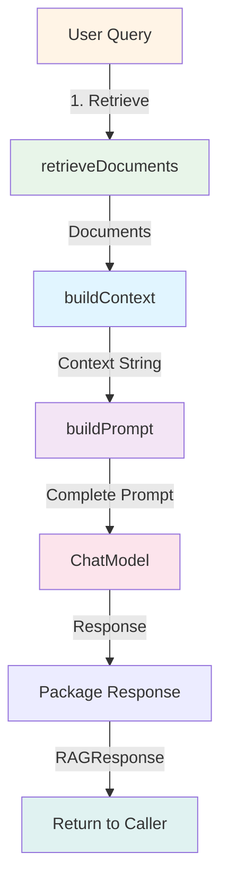

# Simple RAG Service

## Overview

The `SimpleRAGService` implements a **Retrieval-Augmented Generation (RAG)** system that retrieves relevant documents and generates contextual responses. This component serves as the foundation for the secure RAG pipeline, demonstrating basic RAG mechanics before security layers are added.

This is a simplified implementation focused on demonstrating the security architecture. In production, you would integrate with vector stores like Pinecone, Weaviate, or pgvector.

## What is RAG?

**Retrieval-Augmented Generation** combines document retrieval with LLM generation:

1. **Retrieval**: Search for relevant documents based on the query
2. **Augmentation**: Add retrieved documents to the prompt as context
3. **Generation**: LLM generates a response grounded in the provided context

### Why RAG?

**Without RAG**:
```
User: "What's our return policy?"
LLM: "I don't have access to your specific company's return policy."
```

**With RAG**:
```
User: "What's our return policy?"
System: [Retrieves policy document]
LLM: "According to our policy, you can return items within 30 days..."
```

**Benefits**:
- **Accuracy**: Responses grounded in factual documents
- **Up-to-date**: Use current documents without retraining
- **Transparency**: Can cite source documents
- **Reduced hallucination**: LLM has concrete context

## Component Responsibilities

1. **Document Retrieval**: Find relevant documents (simulated in this implementation)
2. **Context Building**: Combine documents into a coherent context
3. **Prompt Engineering**: Create effective prompts with context and query
4. **Response Generation**: Use LLM to generate grounded responses

## Implementation

### Location
```
/src/main/java/com/techcorp/assistant/module05/service/SimpleRAGService.java
```

### Core Code

```java
@Service
public class SimpleRAGService {

    private static final Logger log = LoggerFactory.getLogger(SimpleRAGService.class);
    private final ChatModel chatModel;

    public SimpleRAGService(ChatModel chatModel) {
        this.chatModel = chatModel;
    }

    public RAGResponse query(String query, String userId,
                            List<String> userRoles, String department) {
        log.debug("Processing RAG query for user: {}, roles: {}, dept: {}",
            userId, userRoles, department);

        // Simulate document retrieval
        List<RetrievedDocument> documents = retrieveDocuments(query);

        // Build context from documents
        String context = buildContext(documents);

        // Generate response using LLM
        String prompt = buildPrompt(query, context);
        String response = chatModel.chat(prompt);

        log.debug("Generated response: {}", response);

        return new RAGResponse(response, documents);
    }

    private List<RetrievedDocument> retrieveDocuments(String query) {
        // Simplified retrieval - in production would use vector search
        return List.of(
                new RetrievedDocument(
                        "doc1",
                        "Our product offers enterprise-grade security features including encryption at rest and in transit.",
                        0.95,
                        new DocumentMetadata(null, null)
                ),
                new RetrievedDocument(
                        "doc2",
                        "Customer support is available 24/7 via phone, email, and live chat.",
                        0.87,
                        new DocumentMetadata("support", null)
                )
        );
    }

    private String buildContext(List<RetrievedDocument> documents) {
        StringBuilder context = new StringBuilder();
        for (RetrievedDocument doc : documents) {
            context.append(doc.content()).append("\n\n");
        }
        return context.toString();
    }

    private String buildPrompt(String query, String context) {
        return """
                Context:
                %s

                Question: %s

                Instructions: Answer the question based only on the context provided.
                If the answer is not in the context, say "I don't have enough information to answer that."
                """.formatted(context, query);
    }

    public record RAGResponse(String response, List<RetrievedDocument> sourceDocuments) {}

    public record RetrievedDocument(
            String id,
            String content,
            double score,
            DocumentMetadata metadata
    ) {}

    public record DocumentMetadata(String department, String requiredRole) {}
}
```

## How It Works

### RAG Pipeline Flow



### Step-by-Step Process

**Step 1: Document Retrieval**
```java
List<RetrievedDocument> documents = retrieveDocuments(query);
```

In this simplified version, returns hardcoded documents. In production:
```java
// Vector store retrieval
EmbeddingStore<TextSegment> vectorStore = ...;
Embedding queryEmbedding = embeddingModel.embed(query).content();
List<EmbeddingMatch<TextSegment>> matches = vectorStore.findRelevant(
    queryEmbedding, 5
);
```

**Step 2: Context Building**
```java
String context = buildContext(documents);
```

Concatenates document contents:
```
Document 1 content here.

Document 2 content here.

Document 3 content here.
```

**Step 3: Prompt Engineering**
```java
String prompt = buildPrompt(query, context);
```

Creates a structured prompt:
```
Context:
[All retrieved documents]

Question: What's our return policy?

Instructions: Answer the question based only on the context provided.
If the answer is not in the context, say "I don't have enough information to answer that."
```

**Step 4: LLM Generation**
```java
String response = chatModel.chat(prompt);
```

Sends prompt to LLM, receives grounded response.

**Step 5: Response Packaging**
```java
return new RAGResponse(response, documents);
```

Returns both the response and source documents for:
- Security validation (hallucination detection)
- Access control filtering
- Citation/transparency

## Data Models

### RAGResponse

```java
public record RAGResponse(
    String response,
    List<RetrievedDocument> sourceDocuments
) {}
```

**Fields**:
- `response`: LLM-generated answer
- `sourceDocuments`: Documents used to generate the response

**Why include sourceDocuments?**
- Enables hallucination detection by comparing response to sources
- Allows access control filtering before returning to user
- Supports citation and transparency
- Facilitates debugging and quality assessment

### RetrievedDocument

```java
public record RetrievedDocument(
    String id,
    String content,
    double score,
    DocumentMetadata metadata
) {}
```

**Fields**:
- `id`: Unique document identifier
- `content`: Full text of the document chunk
- `score`: Relevance score (0.0-1.0, higher = more relevant)
- `metadata`: Access control and categorization info

### DocumentMetadata

```java
public record DocumentMetadata(
    String department,
    String requiredRole
) {}
```

**Fields**:
- `department`: Department restriction (null = no restriction)
- `requiredRole`: Required role to access (null = no restriction)

## Usage Examples

### Basic Query

```java
@Service
public class ChatService {

    private final SimpleRAGService ragService;

    public String answerQuestion(String question, UserContext user) {
        RAGResponse response = ragService.query(
            question,
            user.getId(),
            user.getRoles(),
            user.getDepartment()
        );

        return response.response();
    }
}
```

### With Source Citation

```java
public String answerWithCitations(String question, UserContext user) {
    RAGResponse response = ragService.query(
        question,
        user.getId(),
        user.getRoles(),
        user.getDepartment()
    );

    StringBuilder answer = new StringBuilder();
    answer.append(response.response());
    answer.append("\n\nSources:\n");

    for (int i = 0; i < response.sourceDocuments().size(); i++) {
        RetrievedDocument doc = response.sourceDocuments().get(i);
        answer.append(String.format("[%d] Document %s (relevance: %.2f)\n",
            i + 1, doc.id(), doc.score()));
    }

    return answer.toString();
}
```

### With Confidence Scoring

```java
public ConfidentResponse answerWithConfidence(String question, UserContext user) {
    RAGResponse response = ragService.query(
        question,
        user.getId(),
        user.getRoles(),
        user.getDepartment()
    );

    // Calculate confidence based on source relevance
    double avgScore = response.sourceDocuments().stream()
        .mapToDouble(RetrievedDocument::score)
        .average()
        .orElse(0.0);

    String confidenceLevel;
    if (avgScore > 0.9) confidenceLevel = "HIGH";
    else if (avgScore > 0.7) confidenceLevel = "MEDIUM";
    else confidenceLevel = "LOW";

    return new ConfidentResponse(
        response.response(),
        confidenceLevel,
        avgScore
    );
}
```

## Production RAG Implementation

### With Vector Store

```java
@Service
public class ProductionRAGService {

    private final EmbeddingModel embeddingModel;
    private final EmbeddingStore<TextSegment> vectorStore;
    private final ChatModel chatModel;

    public RAGResponse query(String query, UserContext user) {
        // Embed query
        Embedding queryEmbedding = embeddingModel.embed(query).content();

        // Vector search
        List<EmbeddingMatch<TextSegment>> matches = vectorStore.findRelevant(
            queryEmbedding,
            10,  // Retrieve top 10 documents
            0.7  // Minimum similarity threshold
        );

        // Convert to RetrievedDocument
        List<RetrievedDocument> documents = matches.stream()
            .map(match -> new RetrievedDocument(
                match.embedded().metadata("id"),
                match.embedded().text(),
                match.score(),
                extractMetadata(match.embedded())
            ))
            .collect(Collectors.toList());

        // Build context and generate
        String context = buildContext(documents);
        String prompt = buildPrompt(query, context);
        String response = chatModel.chat(prompt);

        return new RAGResponse(response, documents);
    }
}
```

### With Hybrid Search

```java
public List<RetrievedDocument> hybridSearch(String query) {
    // Semantic search (vector similarity)
    List<RetrievedDocument> semanticResults = vectorSearch(query);

    // Keyword search (BM25, Elasticsearch, etc.)
    List<RetrievedDocument> keywordResults = keywordSearch(query);

    // Merge and re-rank
    return mergeAndRerank(semanticResults, keywordResults);
}

private List<RetrievedDocument> mergeAndRerank(
        List<RetrievedDocument> semantic,
        List<RetrievedDocument> keyword) {

    Map<String, RetrievedDocument> merged = new HashMap<>();

    for (RetrievedDocument doc : semantic) {
        merged.put(doc.id(), doc);
    }

    for (RetrievedDocument doc : keyword) {
        if (merged.containsKey(doc.id())) {
            // Document appears in both - boost score
            RetrievedDocument existing = merged.get(doc.id());
            double boostedScore = (existing.score() + doc.score()) / 2;
            merged.put(doc.id(), new RetrievedDocument(
                doc.id(), doc.content(), boostedScore, doc.metadata()
            ));
        } else {
            merged.put(doc.id(), doc);
        }
    }

    return merged.values().stream()
        .sorted(Comparator.comparingDouble(RetrievedDocument::score).reversed())
        .limit(10)
        .collect(Collectors.toList());
}
```

### Advanced Prompt Engineering

```java
private String buildPrompt(String query, String context) {
    return """
            You are a helpful AI assistant for TechCorp.

            Use the following context to answer the user's question.
            Be concise and accurate. Cite specific details from the context when possible.

            IMPORTANT RULES:
            1. Only use information from the provided context
            2. If the context doesn't contain the answer, say "I don't have enough information to answer that question."
            3. Never make up information or use external knowledge
            4. If you're unsure, express uncertainty

            Context:
            %s

            User Question: %s

            Your Response:
            """.formatted(context, query);
}
```

### Re-ranking Retrieved Documents

```java
private List<RetrievedDocument> rerankDocuments(String query,
                                                List<RetrievedDocument> documents) {
    // Use cross-encoder or reranking model
    CrossEncoderModel reranker = CrossEncoderModel.load();

    return documents.stream()
        .map(doc -> {
            double rerankScore = reranker.score(query, doc.content());
            return new RetrievedDocument(
                doc.id(),
                doc.content(),
                rerankScore,
                doc.metadata()
            );
        })
        .sorted(Comparator.comparingDouble(RetrievedDocument::score).reversed())
        .collect(Collectors.toList());
}
```

## Performance Optimization

### Caching Embeddings

```java
@Cacheable(value = "queryEmbeddings", key = "#query")
public Embedding getQueryEmbedding(String query) {
    return embeddingModel.embed(query).content();
}
```

### Async Retrieval

```java
@Async
public CompletableFuture<RAGResponse> queryAsync(String query, UserContext user) {
    return CompletableFuture.completedFuture(query(query, user));
}
```

### Batching

```java
public List<RAGResponse> queryBatch(List<String> queries, UserContext user) {
    return queries.parallelStream()
        .map(query -> query(query, user))
        .collect(Collectors.toList());
}
```

## Testing

### Unit Tests

```java
@ExtendWith(MockitoExtension.class)
class SimpleRAGServiceTest {

    @Mock
    private ChatModel chatModel;

    @InjectMocks
    private SimpleRAGService ragService;

    @Test
    void testQueryReturnsResponse() {
        when(chatModel.chat(anyString())).thenReturn("Test response");

        RAGResponse response = ragService.query(
            "What is the return policy?",
            "user1",
            List.of("user"),
            "sales"
        );

        assertEquals("Test response", response.response());
        assertNotNull(response.sourceDocuments());
        assertFalse(response.sourceDocuments().isEmpty());
    }

    @Test
    void testPromptContainsContext() {
        ArgumentCaptor<String> promptCaptor = ArgumentCaptor.forClass(String.class);
        when(chatModel.chat(anyString())).thenReturn("Response");

        ragService.query("Question", "user1", List.of(), null);

        verify(chatModel).chat(promptCaptor.capture());
        String prompt = promptCaptor.getValue();

        assertTrue(prompt.contains("Context:"));
        assertTrue(prompt.contains("Question:"));
    }
}
```

---

**Next Chapter**: [09 - Secure RAG Controller](./09-secure-rag-controller.md)

**Related Topics**:
- [Document Access Control](./05-document-access-control.md) - Filtering retrieved documents
- [Output Validator](./04-output-validator.md) - Validating RAG responses
